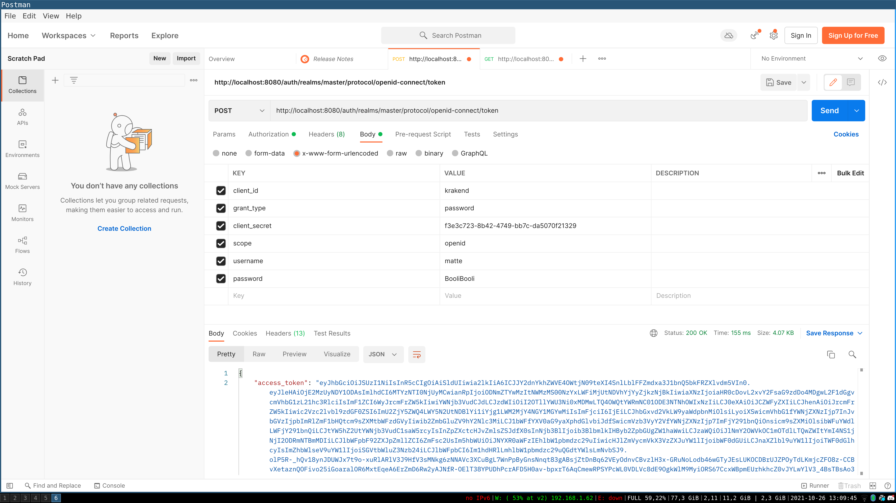

# Keyclouk and Krakend Integration


## Use Krakend to validate keyclouk accesstokens

First the user login into keyclouk to get a access token.
the access token is then used to validate the request aginst backend service


## Start the project

to start the project use docker compose 

```
docker-compose up
```

### this will happens

- Kraken config in /etc/ will be added to the krakend images
- During start nginx folder will be mounted into nginx controller.


## Config Keyclouk
The first we need to do is access keyclouak and setup a new client that we can use.
Login to keyclouk at http://localhost:8080 and the user and password in the docker-compose file.


### Config a client with the following settings 


### Add a user


## Lets try it out using Postman 
https://www.postman.com/

download and use postman localy so you can access the diffrent values


### Get the users access token 




As you se here we got a access_token back. this is the token we can use to access to backend service 


### Setup the access token as bearer token


### Get access to the backend


## How do we verify the access
When a request are sent to Krakend krakend has the public JWT key and with that key decrypt the JWT.
If the encrypotn are a sucess then request are forwared to the backend and allowed.

then config in krakend will protect the endpoint /webb 

```
{
          "endpoint": "/webb",
          "output_encoding": "no-op",

          "extra_config": {
              "github.com/devopsfaith/krakend-jose/validator": {
                  "alg": "RS256",
                  "jwk-url": "http://keycloak:8080/auth/realms/master/protocol/openid-connect/certs",
                  "disable_jwk_security": true
              }
          },
          "backend": [
              {
                "host":["http://nginx"],
                "url_pattern": "/webb",
                "method": "GET",
                "encoding": "no-op"
              }
          ]
        }

```